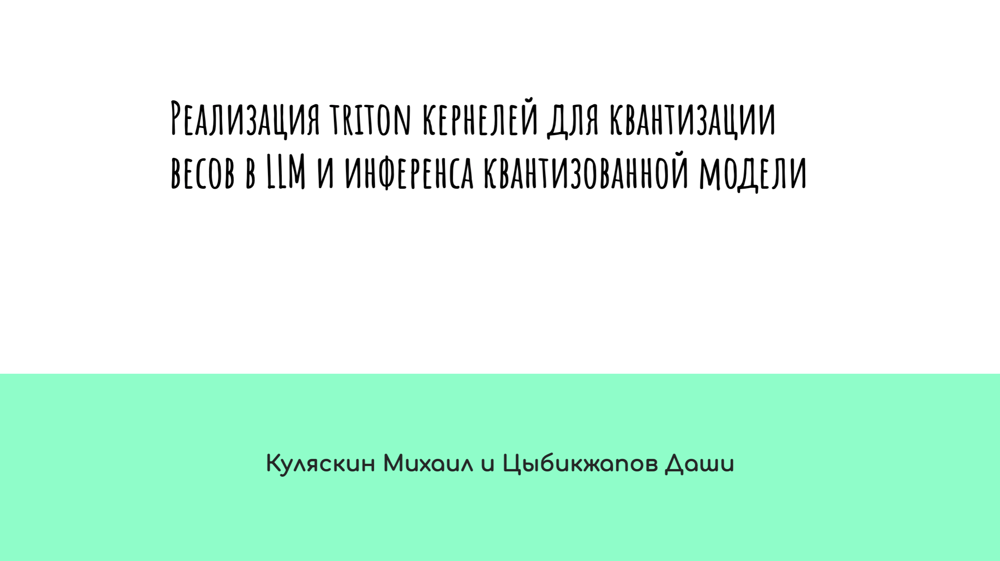
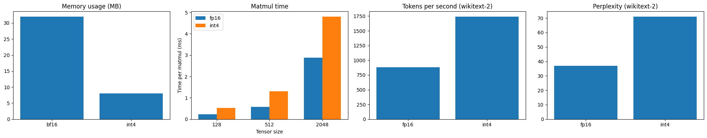

## Efficient-DL-Llama-3-Quant

- **notebooks**: экспериментальные ноутбуки с реализацией и измерениями
- **kernels**: тритон-ядра для квантизации матриц и int4 matmul
- **llama_quant**: код загрузки, квантизации и оценки модели Llama-3.2-1B-Instruct

## Презентация

*Нажмите на изображение, чтобы открыть полную презентацию*

## Результаты

